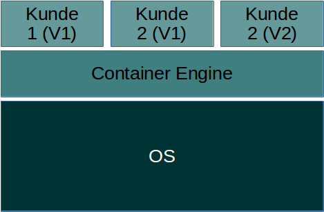
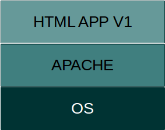
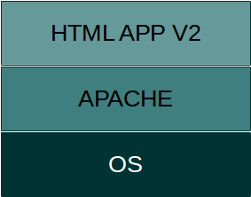

Aufbau
******
Docker ist eine Software die Anwendungen mit Betriebsystemvirtualisierung in Container isolieren kann.
Hierfür werden Kernelkomponente wie CGROUP, libcontainer, namespaces usw. verwendet.
In einem Docker Container können alle benötigte Softwarepakete installiert werden und dann auf jedem kompatiblem System ausgeführt werden.
Hierfür muss legentlich der Docker Service installiert werden.

Dieses Kapitel erkärt den Aufbau und die wichtigsten Komponenten von Docker.

Docker Container
""""""""""""""""
Durch Container können komplette Lauzeitumgebungen in einer geschlossenen isolierten Umgebung gestartet werden. Innerhalb eines Container wird nur ein Mini Kernel und die benötigte Software
installiert und auf den Servern gestartet. Für den Betrieb einer Container Umgebung kein zusätzlicher Hypervisor nötig, die Container werden mit Betriebsytemkomponenten wie Namespaces und Cgroups
betrieben. Vorteile von diesem Vorgehen ist der geringe Overhead für den Betrieb. Auch können mehrere Kundenumgebungen oder Softwareversionen isoliert auf einem Server betrieben werden. Die
untenstehende Grafik zeigt ein mögliches Szenario einer Docker Umgebung. Beim Kunden 2 könnten 2 Versionen betrieben um einen Release zu testen.

.. hint::
    Jeder Docker Container führt genau einen Befehl aus und wenn das Command beendet ist wird der Container wieder runtergefahren. Serverdienste wie Apache oder MySQL werden innerhalb des Container als Service gestartet. Somit laufen diese Container bis sie gestoppt oder unerwartet beendet werden.

Mit docker ps können die laufenden Container angezeigt werden.

 .. code-block:: guess

  # docker ps
  CONTAINER ID        IMAGE               COMMAND              CREATED             STATUS              PORTS               NAMES
  5adc9838407d        httpd               "httpd-foreground"   20 seconds ago      Up 19 seconds       80/tcp              evil_newton

Images
""""""
Docker Container werden vor ihrem gebrauch paketiert und dann auf die Server verteilt.
Diese "Pakete" werden **Images** genannt und ein Container besteht aus einem oder meist mehreren Images-Schichten auch **Layer** genannt.
Jeder Docker Container wird von einem Image gestartet. Man kann sich das wie eine CD vorstellen die abgespielt wird.

Wir stellen uns vor wir haben eine kleine HTML APP die auf einem Container betrieben wird. Für diesen Container werden somit mindestens 3 Layer benötigt.
Die erste Schicht wird ein Basis Layer sein dass den OS Teil mit einem Mini-Kernel behinhaltet. Für den Betrieb wird ein Apache Webserver benötigt, daher wird dieser im Layer 2 installiert.
Die eigentliche Webapplikation (V1) wird dann auf den Container kopiert und somit in den Layer 3. Die Grafik unten zeigt die verschiedenen Layer nochmal.

Wenn der Entwickler nun eine neue Version seiner Applikation erstellt kann er dieses an dem Image anhängen. Es wird eine zusätzliche Version des Image erstellt auf der die aktualiserte Webapp
kopiert wurde (V2). Der Systemadmin muss nun nur den Container von der neuen Version starten.

Falls ein Problem mit dieser Version besteht, kann der Admin auf die V1 zurückgehen da diese Version noch auf dem Server vorhanden ist. Falls alles ohne Probleme funktioniert kann das Image mit
der Version V1 gelöscht werden. Auch wird ein Image Layer der nur von mehreren Container gebraucht werden kann (zb. OS Layer) nur einmal runtergeladen und von allen Container geteilt.
Dieser Layer kann dann nur von dem System gelöscht werden wenn er von keinem Container mehr verwendet wird. Im unten gezeigten Beispiel wird ein Apache2 Image gezeigt.

  .. code-block:: guess

   IMAGE            CREATED             CREATED BY                                      SIZE
   9a0bc463edaa     9 days ago          /bin/sh -c #(nop)  CMD ["httpd-foreground"]     0 B
   <missing>        9 days ago          /bin/sh -c #(nop)  EXPOSE 80/tcp                0 B
   <missing>        9 days ago          /bin/sh -c #(nop) COPY file:761e313354b918b6c   133 B
   <missing>        9 days ago          /bin/sh -c set -x  && buildDeps='   bzip2   c   29.17 MB
   <missing>        9 days ago          /bin/sh -c #(nop)  ENV HTTPD_ASC_URL=https://   0 B
   <missing>        9 days ago          /bin/sh -c #(nop)  ENV HTTPD_BZ2_URL=https://   0 B
   <missing>        9 days ago          /bin/sh -c #(nop)  ENV HTTPD_SHA1=5101be34ac4   0 B
   <missing>        9 days ago          /bin/sh -c #(nop)  ENV HTTPD_VERSION=2.4.23     0 B
   <missing>        9 days ago          /bin/sh -c apt-get update  && apt-get install   41.15 MB
   <missing>        9 days ago          /bin/sh -c #(nop)  WORKDIR /usr/local/apache2   0 B
   <missing>        9 days ago          /bin/sh -c mkdir -p "$HTTPD_PREFIX"  && chown   0 B
   <missing>        9 days ago          /bin/sh -c #(nop)  ENV PATH=/usr/local/apache   0 B
   <missing>        9 days ago          /bin/sh -c #(nop)  ENV HTTPD_PREFIX=/usr/loca   0 B
   <missing>        9 days ago          /bin/sh -c #(nop)  CMD ["/bin/bash"]            0 B
   <missing>        9 days ago          /bin/sh -c #(nop) ADD file:23aa4f893e3288698c   123 MB

Dockerfiles
"""""""""""
Dockerfiles sind Textfiles die Instruktionen für die Erstellung von Containre beinhaltet. Diese Befehle bestimmen die Grundimages der Container, enthalten die Installationbefehlen
und je nach Umfang den Softwarecode der Applikation. Dockerfiles müssen auf einer Registry oder einem Sytem das Docker installiert hat gebuildet werden. Bei diesem Vorgang wird aus einem Dockerfile
ein Image verteilt werden kann.

  .. code-block:: guess

   FROM debian:jessie

   MAINTAINER  Kristjan Perlaska <kristjan.perlaska@gmail.com>

   RUN apt-get update && \
   apt-get install -y \
      apache2 \
      libapache2-mod-php5 \
      php5 \
      php-apc \
      php5-apcu \
      php5-cli \
      php5-curl \
      php5-fpm \
      php5-gd \
      php5-gmp \
      php5-imagick \
      php5-intl \
      php5-ldap \
      php5-mcrypt \
      php5-mysqlnd \
      php5-pgsql \
      php5-sqlite \
      wget \
      unzip
   ADD entry.sh /entry.sh

   RUN chmod +x /entry.sh

   ADD http_config /etc/apache2/sites-available/000-default.conf

   RUN chown -R www-data:www-data /var/www/html

   EXPOSE 80 443

   ENTRYPOINT ["/usr/sbin/apache2ctl", "-D", "FOREGROUND"]

Dockerhub / Docker Registry
"""""""""""""""""""""""""""
Ein weiter Vorteil von Docker ist die zentrale Imageverwaltung Dockerhub. Für viele Anwednungszwecke ist bereits ein Dockercontainer vorhanden.
Je nach Software bietet der Hersteller (Apache, MySQL, Nginx) oder die OpenSource Community ein Container an. Dockerhub kann auf ein GIT Repo verknüpft werden und so ein Dockerfile in
ein Image builden. Der Workflow kann da so aussehen:

  * Entwickler erstellt ein Docker Container auf seinem Client und pusht das Dockerfile in das GIT REPO
  * Dockerfile wird auf Dockerhub in ein Image verwandelt
  * Admin push den Container auf Testumgebung
  * Nach erfolgreichen Tests wird der Container auf die produktive Umgebung gepusht

Die Images können für den öffentlichen Gebrauch gesperrt werden falls das
Image vertrauliche Daten enthält oder es kann eine eigene Registry betrieben werden die alle Funktionen von Dockerhub enthält.
Docker Images können mit Docker Pull heruntergeladen werden.

 .. code-block:: guess

      docker pull nginx
      Using default tag: latest
      latest: Pulling from library/nginx

      43c265008fae: Already exists
      e4c030a565b1: Pull complete
      685b7631c1ce: Pull complete
      Digest: sha256:dedbce721065b2bcfae35d2b0690857bb6c3b4b7dd48bfe7fc7b53693731beff
      Status: Downloaded newer image for nginx:latest

Übungen
"""""""
 1. Besuche die `Dockerhub <https://hub.docker.com/>`_ und suche nach dem Apache2 Image
 2. Suche auch folgende Image damit du die Möglichkeiten von Docker siehst:

    * Wordpress
    * NextClooud
    * MySQL

 3. Hohle dir noch mehr Informationen über Docker
 
    * https://de.wikipedia.org/wiki/Docker_(Software)
    * https://www.docker.com/what-docker
