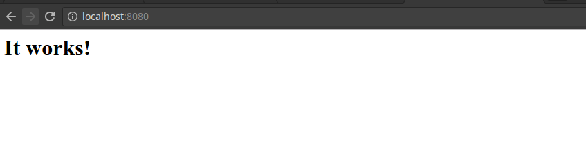
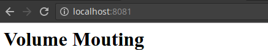

Basis
*****

.. hint::
    Die ID's der Container sind auf jeden System anders.
    Daher müssen die ID's aus der eigenen Schulungsumgebung genommen werden.

docker pull
"""""""""""
Docker Pull kann für den Download von Images von einer Registry gebraucht werden.

.. code-block:: guess

     # docker pull nginx
     Using default tag: latest
     latest: Pulling from library/nginx

     43c265008fae: Already exists
     e4c030a565b1: Pull complete
     685b7631c1ce: Pull complete
     Digest: sha256:dedbce721065b2bcfae35d2b0690857bb6c3b4b7dd48bfe7fc7b53693731beff
     Status: Downloaded newer image for nginx:latest

Wenn keine Option angegeben wird immer die letzte (latest) Version heruntergeladen.

Falls eine bestimmte Version von einer Software benötigt wird kann mit einem Release Tag diese angegeben werden. Diese werden nach dem Image mit einem Doppelpunkt definiert (nginx:1.9).

.. code-block:: guess

     # docker pull nginx:1.9
     1.9: Pulling from library/nginx

     51f5c6a04d83: Downloading 15.73 MB/51.36 MB
     a3ed95caeb02: Download complete
     640c8f3d0eb2: Downloading 5.062 MB/19.82 MB
     a4335300aa89: Download complete

docker images
"""""""""""""
Docker images zeigt alle heruntergeladenen Images an. Hierbei werden alle Versionen eines Image angezeigt.

.. code-block:: guess

    # docker images
    REPOSITORY          TAG                 IMAGE ID            CREATED             SIZE
    nginx               latest              e43d811ce2f4        9 days ago          181.5 MB
    mysql               latest              cf725f136fd2        9 days ago          383.4 MB
    httpd               latest              9a0bc463edaa        9 days ago          193.3 MB
    nginx               1.9                 c8c29d842c09        5 months ago        182.8 MB

docker rmi
""""""""""
Falls ein Image gelöscht werden möchte kann das über docker rmi (remove image) gemacht werden. Hierbei muss die Image ID angegeben werden.
Diese kann abgekürzt werden: Die ID muss nur soweit angegen werden bis das Image eindeutig identifzierbar ist.

.. code-block:: guess

    # docker rmi e43
    Untagged: nginx:latest
    Untagged: nginx@sha256:dedbce721065b2bcfae35d2b0690857bb6c3b4b7dd48bfe7fc7b53693731beff
    Deleted: sha256:e43d811ce2f4986aa69bc8ba6c92f0789537f604d1601e0b6ec024e1c38062b4
    Deleted: sha256:4ea7c4dceac2dbc035c7b66c24867a22949ac2e1f7c93336b2b4e12177a09368
    Deleted: sha256:78024ac53358a9a2d4abf0738ab648b492638b2dc65d672a47bace227758795f

docker ps
"""""""""
Docker ps zeigt alle Container an die auf dem System gestartet sind oder je gestartet wurden.

.. code-block:: guess

    # docker ps
    CONTAINER ID        IMAGE               COMMAND              CREATED              STATUS              PORTS               NAMES
    820f72c5abf9        httpd               "httpd-foreground"   About a minute ago   Up About a minute   80/tcp              elegant_keller

Mit der Option -a können alle Container angezeigt werden die je gestartet wurden.

.. code-block:: guess

    # docker ps -a
    CONTAINER ID        IMAGE               COMMAND              CREATED             STATUS                      PORTS               NAMES
    820f72c5abf9        httpd               "httpd-foreground"   2 minutes ago       Up 2 minutes                80/tcp              elegant_keller
    b0ed5b039b62        httpd               "httpd-foreground"   9 minutes ago       Exited (0) 9 minutes ago                        kickass_payne
    79956056ba56        httpd               "httpd-foreground"   10 minutes ago      Exited (0) 10 minutes ago                       drunk_goldberg

Eine Erklärung aller Spalten sieht man in folgender Tabelle.

+--------------+------------------+-----------------+-------------------+----------------+---------------+----------+
|CONTAINER ID  |IMAGE             |COMMAND          |CREATED            |STATUS          |PORTS          |NAMES     |
+==============+==================+=================+===================+================+===============+==========+
|Eindeutige ID |Image von dem der |Das Kommando das |Wann der Container |Seit wann der   |Port innerhalb |Name des  |
|              |Container         |innerhalb des    |erstellt wurde     |Container läuft |des Container  |Container |
|              |gestartet wird    |Container        |                   |                |               |          |
|              |                  |ausgeführt wird  |                   |                |               |          |
+--------------+------------------+-----------------+-------------------+----------------+---------------+----------+

docker run
""""""""""
Docker run startet die Container aus einem Image heraus. Das Command kann Container mit vielen Optionen starten und die wichtigsten sind -v (Volume Mounten), -p (Port Freigabe) und -d (Detach).
Als erstes werden wir einen Apache Container starten um den Nutzen der Optionen -v, -p und -d zu zeigen.

.. hint::
    Wenn ein Container ohne Optionen gestartet wird kann auf die Ressourcen nicht zugegriffen werden, da er komplett isoliert ist. Optionen wie -p erlauben ein Port Mapping auf den Container, -v
    mountet lokale Sytemressourcen. In diesem Kapitel werden nur diese 3 Optionen beschrieben. Eine weitere praktische Funktion ist --name mit dem der Contaienr benannt werden kann. Falls diese
    nicht gesetzt ist wird ein Zufallsname generiert.

docker run (Ohne Optionen)
--------------------------
Das Apache Container wird mit folgenden Command gestartet. Falls das Image nicht vorhanden wird es automatisch runtergeladen.

.. code-block:: guess

    # docker run httpd
    AH00558: httpd: Could not reliably determine the server's fully qualified domain name, using 172.17.0.3. Set the 'ServerName' directive globally to suppress this message
    AH00558: httpd: Could not reliably determine the server's fully qualified domain name, using 172.17.0.3. Set the 'ServerName' directive globally to suppress this message
    [Mon Oct 31 16:50:19.112710 2016] [mpm_event:notice] [pid 1:tid 139941367809920] AH00489: Apache/2.4.23 (Unix) configured -- resuming normal operations
    [Mon Oct 31 16:50:19.112783 2016] [core:notice] [pid 1:tid 139941367809920] AH00094: Command line: 'httpd -D FOREGROUND'

Der Container wird im Vordergrund gestartet und man kann den Output der Logfiles sehen.

docker run (-d, Container im Hintergrund starten)
-------------------------------------------------
Der Apache Container wird in diesem Beispiel mit der Option -d und somit "Detached" im Hintergrund gestartet.

.. code-block:: guess

    # docker run -d httpd
    820f72c5abf9b33d8c8a7b03c4a4e17191553c833fe09811978ea2be91c0446b

Es wird nur ein ID angezeigt die der Docker Container ID entspricht. Mit dem Command docker ps können die Container angezeigt werden.

.. code-block:: guess

    # docker ps
    CONTAINER ID        IMAGE               COMMAND              CREATED              STATUS              PORTS               NAMES
    820f72c5abf9        httpd               "httpd-foreground"   About a minute ago   Up About a minute   80/tcp              elegant_keller

docker run (-p Port Mapping auf den Container)
----------------------------------------------
Mit diesem Command können die Ports des Container auf einen beliebigen Port auf dem Betriebsystem gemappt werden. Wir schauen uns als erstes
den vorher gestarteten Container an:

.. code-block:: guess

    # docker ps
    CONTAINER ID        IMAGE               COMMAND              CREATED              STATUS              PORTS               NAMES
    820f72c5abf9        httpd               "httpd-foreground"   About a minute ago   Up About a minute   80/tcp              elegant_keller

Auf der Kolone 6 sehen wir den internen Port des Container, bei einem Standard Apache Server Port 80. Wir starten einen zweiten Apache Container
jedoch mit der Port Mapping Option.

.. code-block:: guess

    # docker run -d -p 8080:80 httpd
    741ee0fc9b44b37447e08bc0c71c551b58041867ee644c1dba91047cc22dee2f

Wenn wir die Container nochmal anzeigen lassen sehen wir nun das der Port 8080 des Hosts auf den Port 80 des Container gemappt ist.

.. code-block:: guess

    # docker ps
    CONTAINER ID        IMAGE               COMMAND              CREATED             STATUS              PORTS                  NAMES
    741ee0fc9b44        httpd               "httpd-foreground"   24 seconds ago      Up 23 seconds       0.0.0.0:8080->80/tcp   prickly_liskov
    820f72c5abf9        httpd               "httpd-foreground"   9 minutes ago       Up 9 minutes        80/tcp                 elegant_keller

Wenn wir im Webrowser nun <HOST>:8080 eingeben erhalten wir die Startseite des Apache Servers

docker run (-v Mounten von lokalen Ressourcen )
-----------------------------------------------
In diesem Beispiel wird zusätzlich noch ein lokales Volume gemountet. Dadurch können Logfiles der Container zentral abgelegt werden oder lokale
Ressourcen wie Webseiten im Container vearbeitet werden. Für dieses Beispiel haben wir einen lokalen Folder unter **/tmp/data/** mit dem File **index.html**.
Der Container wird mit dem Port 8081 gestartet.

.. code-block:: guess

    # docker run -d -p 8081:80 -v /tmp/data/:/usr/local/apache2/htdocs/ httpd
    6148b849cba71d0e5dbe309ac1d39658e847e17a660fca4ee465a90669ff2a76

Docker ps zeigt uns den neu gestartetet Container an, jedoch keine Mouting Optionen. Diese können mit Docker Inspect angezeigt werden das im Fortgeschrittenen Modul
behandelt wird.

.. code-block:: guess

     # docker ps
     CONTAINER ID        IMAGE               COMMAND              CREATED              STATUS              PORTS                  NAMES
     6148b849cba7        httpd               "httpd-foreground"   About a minute ago   Up About a minute   0.0.0.0:8081->80/tcp   romantic_heisenberg
     741ee0fc9b44        httpd               "httpd-foreground"   38 minutes ago       Up 38 minutes       0.0.0.0:8080->80/tcp   prickly_liskov
     820f72c5abf9        httpd               "httpd-foreground"   47 minutes ago       Up 47 minutes       80/tcp                 elegant_keller

Der Zugriff auf den Browser kann nun über <HOST>:8081 gemacht werden.

.. hint::
    Jede Container ID wird per Zufall generiert und somit kann ein Container nie die gleiche ID haben. Auch wenn ein Container gelöscht wird und
    ein neuer Container auf gleicher Basis erstellt wird erhählt dieser eine neue ID.

docker stop
"""""""""""
Docker stop wird verwendet um Container zu stoppen. Den zu stoppenden Container kann mit anhand der  ID angeben. Hierfür lassen wir uns als erstes alle Container anzeigen mit Docker ps.

.. code-block:: guess

    # docker ps
    CONTAINER ID        IMAGE               COMMAND              CREATED             STATUS              PORTS                  NAMES
    6148b849cba7        httpd               "httpd-foreground"   About an hour ago   Up About an hour    0.0.0.0:8081->80/tcp   romantic_heisenberg
    741ee0fc9b44        httpd               "httpd-foreground"   About an hour ago   Up About an hour    0.0.0.0:8080->80/tcp   prickly_liskov
    820f72c5abf9        httpd               "httpd-foreground"   About an hour ago   Up About an hour    80/tcp                 elegant_keller

Nun werden wir den Container mit der ID 6148b849cba7 stoppen. Docker stop benötigt wie alle anderen ID bezogenen Befehle nur so viel von der ID bis der Container eindeutig identifizierbar ist.

.. code-block:: guess

    # docker stop 614
    614

Nun lassen wir uns alle Container inklusive beendete anzeigen

.. code-block:: guess

    # docker ps -a
    CONTAINER ID        IMAGE               COMMAND              CREATED             STATUS                     PORTS                  NAMES
    6148b849cba7        httpd               "httpd-foreground"   About an hour ago   Exited (0) 3 minutes ago                          romantic_heisenberg
    741ee0fc9b44        httpd               "httpd-foreground"   About an hour ago   Up About an hour           0.0.0.0:8080->80/tcp   prickly_liskov
    820f72c5abf9        httpd               "httpd-foreground"   2 hours ago         Up 2 hours                 80/tcp                 elegant_keller

docker start
""""""""""""
Beendete Container können mit docker start wieder gestartet werden. Als erstes lassen wir uns alle Container inklusive gestoppten anzeigen.

.. code-block:: guess

    # docker ps -a
    CONTAINER ID        IMAGE               COMMAND              CREATED             STATUS                     PORTS                  NAMES
    6148b849cba7        httpd               "httpd-foreground"   About an hour ago   Exited (0) 3 minutes ago                          romantic_heisenberg
    741ee0fc9b44        httpd               "httpd-foreground"   About an hour ago   Up About an hour           0.0.0.0:8080->80/tcp   prickly_liskov
    820f72c5abf9

Nun starten wir den Container

.. code-block:: guess

    # docker start 614
    614

Wenn wir uns alle gestarteten Container anschauen sehen wir das der Container mit der ID 6148b849cba7 wieder gestartet ist.

.. code-block:: guess

    # docker ps
    CONTAINER ID        IMAGE               COMMAND              CREATED             STATUS              PORTS                  NAMES
    6148b849cba7        httpd               "httpd-foreground"   About an hour ago   Up 1 seconds        0.0.0.0:8081->80/tcp   romantic_heisenberg
    741ee0fc9b44        httpd               "httpd-foreground"   About an hour ago   Up About an hour    0.0.0.0:8080->80/tcp   prickly_liskov
    820f72c5abf9        httpd               "httpd-foreground"   2 hours ago         Up 2 hours          80/tcp                 elegant_keller

docker restart
""""""""""""""
Docker restart fährt einen Container herunter und startet den Container dann direkt wieder

.. code-block:: guess

    # docker restart 614
    614

Ob ein Container neugestartet wurde kann man in der Kolone **STATUS** sehen wenn man sich alle Container anzeigen lässt.

.. code-block:: guess

    # docker ps
    CONTAINER ID        IMAGE               COMMAND              CREATED             STATUS              PORTS                  NAMES
    6148b849cba7        httpd               "httpd-foreground"   About an hour ago   Up 12 seconds       0.0.0.0:8081->80/tcp   romantic_heisenberg
    741ee0fc9b44        httpd               "httpd-foreground"   About an hour ago   Up About an hour    0.0.0.0:8080->80/tcp   prickly_liskov
    820f72c5abf9        httpd               "httpd-foreground"   2 hours ago         Up 2 hours          80/tcp                 elegant_keller

docker rm
"""""""""
Mit Docker rm kann ein Container gelöscht werden. Hierfür wird wie bis anhin die ID des Container benötigt. Auch hier kann man sich es sparen die
komplette ID einzugeben, sondern nur so viel bis der Container eindeutig identifizierbar ist. Der Container muss beendet sein damit man ihn löschen kann.
Wir schauen uns zuerst alle laufenden Container an.

.. code-block:: guess

    # docker ps
    CONTAINER ID        IMAGE               COMMAND              CREATED             STATUS              PORTS                  NAMES
    6148b849cba7        httpd               "httpd-foreground"   About an hour ago   Up 3 minutes        0.0.0.0:8081->80/tcp   romantic_heisenberg
    741ee0fc9b44        httpd               "httpd-foreground"   2 hours ago         Up 2 hours          0.0.0.0:8080->80/tcp   prickly_liskov
    820f72c5abf9        httpd               "httpd-foreground"   2 hours ago         Up 2 hours          80/tcp                 elegant_keller

Nun beenden wir den Container mit der ID 6148b849cba7.

.. code-block:: guess

    # docker stop 614
    614

Jetzt können wir den Container löschen

.. code-block:: guess

    # docker rm 614
    614

Wenn wir uns nun alle Container anzeigen lassen ist der Container mit der ID 614 wie gewünscht verschwunden.

.. code-block:: guess

    # docker ps -a
    CONTAINER ID        IMAGE               COMMAND              CREATED             STATUS              PORTS                  NAMES
    741ee0fc9b44        httpd               "httpd-foreground"   2 hours ago         Up 2 hours          0.0.0.0:8080->80/tcp   prickly_liskov
    820f72c5abf9        httpd               "httpd-foreground"   2 hours ago         Up 2 hours          80/tcp                 elegant_keller

Übungen
"""""""
Folgenden Übungen sollten nun ohne Probleme durchgeführt werden können.

 1. Pullen eines Apache Images
 2. Pullen eines Aapche Images der Version 2.4.XX
 3. Löschen von dem Apache Image 2.4.XX
 4. Starten eines Apache Container im Vordergrund
 5. Starten eiens Apache Container im Hintergrund
 6. Port 8000 auf den Apache Container mappen und starten
 7. Lokales Volume im Temp Verzeichnis erstellen
    Container starten mit einem Mount
 8. Stop, Start und Neustart eines Container
 9. Löschen eines Container
