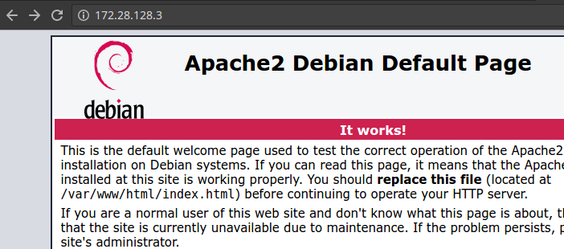

Dockerfiles
***********
Dockerfiles sind die Grundlage für Docker Images. Diese bestehen aus Anweisungen die man dem Container gibt die dann von Docker gebaut werden.
In diesem Beispiel werden wir ein eigenes Apache Image bauen.

Aufbau eines Dockerfile
=======================
Das komplette Dockerfile wird wie folgt aussehen:

.. code-block:: guess

    FROM debian:jessie

    MAINTAINER  Kristjan Perlaska <kristjan.perlaska@gmail.com>

    RUN apt-get update && \
     apt-get install -y apache2

    EXPOSE 80

    ENTRYPOINT ["/usr/sbin/apache2ctl", "-D", "FOREGROUND"]

Wir werden nun Block für Block durchgehen.

Die ist das Basis Image das wir für den Container auswählen. Wir könnten auch centos, ubuntu oder alphine Linux benützen.

.. code-block:: guess

    FROM debian:jessie

Der Maintainer und Entwickler des Image.

.. code-block:: guess

    MAINTAINER  Kristjan Perlaska <kristjan.perlaska@gmail.com>

Die Installationsroutine für die Software.

.. code-block:: guess

    RUN apt-get update && \
     apt-get install -y apache2

Der Port der **im** Container freigegeben wird und von aussen gemappt werden kann. Dieser muss dem Port der Applikation entsprechen.

.. code-block:: guess

    EXPOSE 80

Mit ENTRYPOINT kann das eigentliche Kommando angegeben werden das von dem Container ausgeführt wird. In diesem Beispiel werden wir Apache2 im Fordergrund starten.
Kommandos müssen im JSON Format angegeben werden.

.. code-block:: guess

    ENTRYPOINT ["/usr/sbin/apache2ctl", "-D", "FOREGROUND"]

Container Image erstellen
=========================
Wir nehmen das obige Dockerfile und speichern dieses unte /home/vagrant/ mit dem Namen dockerfile

.. code-block:: guess

    echo '
     FROM debian:jessie

     MAINTAINER  Kristjan Perlaska <kristjan.perlaska@gmail.com>

     RUN apt-get update && \
      apt-get install -y apache2

     EXPOSE 80

     ENTRYPOINT ["/usr/sbin/apache2ctl", "-D", "FOREGROUND"]
    ' >> ~/dockerfile

und schauen uns anschliessen das Dockerfile an

.. code-block:: guess

     # cat dockerfile

     FROM debian:jessie

     MAINTAINER  Kristjan Perlaska <kristjan.perlaska@gmail.com>

     RUN apt-get update &&       apt-get install -y apache2

     EXPOSE 80

     ENTRYPOINT [/usr/sbin/apache2ctl, -D, FOREGROUND]

Mit Docker build können wir das Image nun erstellen. Mit der Option -t können den Imagenamen/Imagetag mitgeben. Wir nehmen -t edu/httpd

.. code-block:: guess

    # docker build -t edu/httpd .
    Sending build context to Docker daemon 3.514 MB
    Step 1 : FROM debian:jessie
    jessie: Pulling from library/debian

    43c265008fae: Pull complete
    Digest: sha256:c1af755d300d0c65bb1194d24bce561d70c98a54fb5ce5b1693beb4f7988272f
    Status: Downloaded newer image for debian:jessie
     ---> 7b0a06c805e8
    Step 2 : MAINTAINER Kristjan Perlaska <kristjan.perlaska@gmail.com>
     ---> Running in 0fbbd9c4a4fd
     ---> 1cce5400514e
    Removing intermediate container 0fbbd9c4a4fd
    ....

    Removing intermediate container 28d1ef7133de
    Step 4 : EXPOSE 80
     ---> Running in 4cc546fce6c5
     ---> 8ed628851ef0
    Removing intermediate container 4cc546fce6c5
    Step 5 : ENTRYPOINT [/usr/sbin/apache2ctl, -D, FOREGROUND]
     ---> Running in b96fb674a37f
     ---> 77a7ab4cdbea
    Removing intermediate container b96fb674a37f
    Successfully built 77a7ab4cdbea

Den nun erstellten Container können wir uns mit docker images anschauen...

.. code-block:: guess

    # docker images
    REPOSITORY          TAG                 IMAGE ID            CREATED             SIZE
    edu/httpd           latest              77a7ab4cdbea        21 minutes ago      191.5 MB
    debian              jessie              7b0a06c805e8        13 days ago         123 MB

... und anschliessen gleich starten

.. code-block:: guess

    # docker run -d -p 80:80 edu/httpd
    aec57e5e25ff2849955966ef18d83222921d2a5bfad3ea337bf2c129349e077b

Der Container sollte nun laufen und über einen Webbrowser erreichbar.

# docker ps

.. code-block:: guess

    docker ps
    CONTAINER ID        IMAGE               COMMAND                  CREATED             STATUS              PORTS                NAMES
    aec57e5e25ff        edu/httpd           "/usr/sbin/apache2ctl"   48 seconds ago      Up 47 seconds       0.0.0.0:80->80/tcp   pensive_nobel

Webbrowser

Übungen
=======
 1. Erstelle ein komplettes Apache Dockerfile
 2. Ergänze das Dockerfile mit dem PHP Module und füge folgenden PHP Code in dein HTML File:
    <?php phpinfo(); ?>
