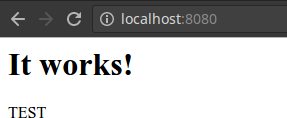

Fortgeschritten
***************

Kombinierte Befehle
"""""""""""""""""""
Quiet-Option
============
Die Quiet Funktion unterdrückt alle Information aus dem Output eines Befehls und zeigt nur die ID eines Images oder Container an

Alle ID von allen Container anzeigen

.. code-block:: guess

    # docker ps -q
    741ee0fc9b44
    820f72c5abf9

Alle ID von allen Images anzeigen

.. code-block:: guess

    # docker images -q
    cf725f136fd2
    9a0bc463edaa
    c8c29d842c09

Diese ID's werden in den nächsten Unterkapitel gebraucht

Alle Container stoppen/starten
==============================
Falls alle Contaienr gestoppt werden müssen kann das mit einer kombination von docker stop und docker ps -q gemacht werden. Ein
Szenario um alle Container zu stoppen währe ein Sicherheitsudpate innerhalb eines Docker Images. Wir lassen uns alle Container anzeigen.

.. code-block:: guess

    # docker ps
    CONTAINER ID        IMAGE               COMMAND              CREATED             STATUS              PORTS                  NAMES
    741ee0fc9b44        httpd               "httpd-foreground"   3 hours ago         Up About a minute   0.0.0.0:8080->80/tcp   prickly_liskov
    820f72c5abf9        httpd               "httpd-foreground"   3 hours ago         Up About a minute   80/tcp                 elegant_keller

.. code-block:: guess

    # docker stop $(docker ps -q)
    741ee0fc9b44
    820f72c5abf9

Die Container können alle miteinander wieder gestartet werden mit docker start und docker ps -q. Jedoch muss hier der Schalter -a hinzugefügt werden, da die Container beendet wurden.

Container anzeigen lassen mit -a da sie beendet wurden.

.. code-block:: guess

    # docker ps -a
    CONTAINER ID        IMAGE               COMMAND              CREATED             STATUS                     PORTS               NAMES
    741ee0fc9b44        httpd               "httpd-foreground"   3 hours ago         Exited (0) 5 seconds ago                       prickly_liskov
    820f72c5abf9        httpd               "httpd-foreground"   3 hours ago         Exited (0) 5 seconds ago                       elegant_keller

Die Container werden nun mit gestoppt.

.. code-block:: guess

    # docker start $(docker ps -qa)
    741ee0fc9b44
    820f72c5abf9

Container anzeigen lassen

.. code-block:: guess

    # docker ps -a
    CONTAINER ID        IMAGE               COMMAND              CREATED             STATUS              PORTS                  NAMES
    741ee0fc9b44        httpd               "httpd-foreground"   3 hours ago         Up 4 seconds        0.0.0.0:8080->80/tcp   prickly_liskov
    820f72c5abf9        httpd               "httpd-foreground"   3 hours ago         Up 4 seconds        80/tcp                 elegant_keller

Alle Container löschen
======================
Falls ein System bereinigt werden muss kann man alle Container auf einmal löschen. Hierfür wird docker mit docker ps -q rm kombiniert. Bevor man aber die Container überhaupt löschen kan müssen
diese zuerst beendet werden.

.. code-block:: guess

    # docker stop $(docker ps -q)
    741ee0fc9b44
    820f72c5abf9

Nun kann man mit docker rm und docker ps -qa alle Container löschen.

.. code-block:: guess

    # docker rm $(docker ps -qa)
    741ee0fc9b44
    820f72c5abf9

Nun sollten keine Container mehr vorhanden sein.

.. code-block:: guess

    # docker ps -a
    CONTAINER ID        IMAGE               COMMAND             CREATED             STATUS              PORTS               NAMES

Alle Images löschen
===================
Wir werden als nächsten Schritt alle Images löschen. Wie bereits in den letzten Kommandos ist das eine Kombination von docker images -q und docker rmi.

.. code-block:: guess

    # docker rmi $(docker images -q)
    Untagged: mysql:latest
    Untagged: mysql@sha256:35c9613263b6ecd9ad88e8f3e91fb5b764e623d4e40b0f999fe0f06e9c1d4754
    Deleted: sha256:cf725f136fd285d64f69fc9388d452c5c30bc89e74bd91c508d6455af7dc148e
    Deleted: sha256:f5d44dcf2f7cd3cccd78905f6bc473eb7830421f8eb3f30cbf37105265091278
    Deleted: sha256:8741b03df62672a8e521ccfbeb3da962d3f64f94c12578270055a2cb9a55341a
    Deleted: sha256:2a758b73b7252ead78d3147a36f8468c075bfea160affb50a0287f3dd739b2d9
    Deleted: sha256:90584d5d27b0256797d296461cd452a712792c7a99a4aa290efb092702ab9b6e
    Deleted: sha256:5bace12eb4e73fb3d53a574f2bd73a04246629f2e0d8b542365e5829d0b6e7d8
    Deleted: sha256:cd2f13f179a6a7f7b396a37f0354581534ac02d26de8aa698715c272163c49c5
    Deleted: sha256:96a784abc05179b8beedbb7e1951e8dd31b7e9ccf376706cf4c5c00d6bf645e1
    Deleted: sha256:f1eac8426d94411e4b129a3d42bccac84b899ef1c4592ae113d63fd16ab6f695
    Deleted: sha256:f67dd5d6a11f8bf443e8c20aed4e10a3e65d317da4ac0a34454214b84e22d6f5
    Deleted: sha256:52a7fb0cd93f62855f4f6cbff49acfddda67e38e7de3cdf7b434d33257532902
    Untagged: httpd:latest
    Untagged: httpd@sha256:9b29c9ba465af556997e6924f18efc1bbe7af0dc1b3f11884010592e700ddb09
    Deleted: sha256:9a0bc463edaa743d7032815f947b8659d7d7f0435b0cf201d00899c535ef55f1
    Deleted: sha256:08d4d92ec71170f2ea594898640aa9e3efd7cad99fee9ed572e16b2f5e894585
    Deleted: sha256:82f2ced219546b1ba6062e87997576f410a0d38e49ecb5a20a38821527fd3c26
    Deleted: sha256:335e7e2477076f4a76466639075c6119f49f877c9f340a52421ca471acd046e9
    Deleted: sha256:81963b7b421002612b1e25ec0647ff99178e8c23d93901d33715a73bf589b035
    Deleted: sha256:f96222d75c5563900bc4dd852179b720a0885de8f7a0619ba0ac76e92542bbc8
    Untagged: nginx:1.9
    Untagged: nginx@sha256:54313b5c376892d55205f13d620bc3dcccc8e70e596d083953f95e94f071f6db
    Deleted: sha256:c8c29d842c09d6c61f537843808e01c0af4079e9e74079616f57dfcfa91d4e25
    Deleted: sha256:4464994291326a69797cfc8c81fe7895ea295fb1bddf33ff8cc6ac911532d8ec
    Deleted: sha256:ce4898868c91017d0d72206454850e86c10a2bc9eaa65c7c0e456e9f143f2675
    Deleted: sha256:d2e4d218bb50684678a5dcddaba030f031137da4d93bca8ff4f7ffe658e1b36d
    Deleted: sha256:1d3690cfe72be343c7538774d822e56633cd7cb855040a398538e06de8feea8e
    Deleted: sha256:8a12ca546a1bd35ad5d1521645c95bf731bf86ccec2131f5499d1fcdfd5f8d43
    Deleted: sha256:0c01e4298c8c6e3d7452f2a3e61addc98ac96242b0d679ae22ec02dc6961e0d7
    Deleted: sha256:db80480bef0957c557c70969684a28889240dac9f55018d97da96cc2d8948c11
    Deleted: sha256:4dcab49015d47e8f300ec33400a02cebc7b54cadd09c37e49eccbc655279da90

.. hint::
    Docker bietet leider keine Optionen an diese Kommandos Nativ auszüführen, daher ist diese Verknüpfung der Kommandos
    nötig.

docker exec
"""""""""""
Docker exec dient dazu ein zusätzliches Kommando im Container auszführen. Das kann ein Backupscript sein oder eine Bash-Shell um sich somit auf den Container zu verbinden.
Somit können zum Beispiel Logfiles angeschaut, zusätzliche Software installiert oder Content verändert werden. Wir werden als erstes einen Container starten für die nächsten Übungen.

.. code-block:: guess

    # docker run -d -p 8080:80 httpd
    e6d04f6dda086a16517ab5fbfc66dc75c78b1ea7a0fc2a7c631351a20a9e3d1f

Nun werden wir eine Bash starten innerhalb des Containers. Hierfür brauchen wir zuerst die ID des Containers.

.. code-block:: guess

    # docker ps
    CONTAINER ID        IMAGE               COMMAND              CREATED             STATUS              PORTS                  NAMES
    e6d04f6dda08        httpd               "httpd-foreground"   41 seconds ago      Up 40 seconds       0.0.0.0:8080->80/tcp   suspicious_curran

Nun können wir auf den Container connecten.

.. code-block:: guess

    # docker exec -ti e6d bash
    root@e6d04f6dda08:/usr/local/apache2#

Die Optionen -i behaltet die Session offen und die Option -t erstellt eine Pseudo TTY (Terminal). Der Hostname entspricht der ID des Container.

Wir können nun zum Beispiel das Index.html anpassen.

.. code-block:: guess

    root@e6d04f6dda08:/usr/local/apache2# echo "TEST" >> htdocs/index.html
    root@e6d04f6dda08:/usr/local/apache2#

Wir könnnen nun auf die Webseite des Container zugreifen.

Wie bereits erwänt wird bei Docker ein Minisystem gestartet. Sehr gut veranschaulichen können wir uns das wenn wir uns die Prozesse innerhalb
des Container anzeigen lassen.

.. code-block:: guess

    root@e6d04f6dda08:/usr/local/apache2# ps aux
    USER       PID %CPU %MEM    VSZ   RSS TTY      STAT START   TIME COMMAND
    root         1  0.0  0.0  77192  4368 ?        Ss   16:37   0:00 httpd -DFOREGROUND
    daemon       7  0.0  0.0 366372  5460 ?        Sl   16:37   0:00 httpd -DFOREGROUND
    daemon       8  0.0  0.0 366380  5460 ?        Sl   16:37   0:00 httpd -DFOREGROUND
    daemon       9  0.0  0.0 431972  5784 ?        Sl   16:37   0:00 httpd -DFOREGROUND
    root        96  0.2  0.0  20228  3020 ?        Ss   16:49   0:00 bash
    root       102  0.0  0.0  17500  2060 ?        R+   16:49   0:00 ps aux

docker inspect
""""""""""""""
Docker inspect ist ein sehr mächtiges Tool mit dem alle Details eines Container angezeigt werden.
Somit ist es möglich die kompletten Netzwerkeinstellungen eines Container oder mehreren Containern anzuzeigen.

.. code-block:: guess

    # docker inspect e6d
    [
       {
           "Id": "e6d04f6dda086a16517ab5fbfc66dc75c78b1ea7a0fc2a7c631351a20a9e3d1f",
           "Created": "2016-11-03T16:37:43.461900744Z",
           "Path": "httpd-foreground",
           "Args": [],
           "State": {
               "Status": "running",
               "Running": true,
               "Paused": false,
               "Restarting": false,
               "OOMKilled": false,
               "Dead": false,
               "Pid": 3905,
               "ExitCode": 0,
               "Error": "",
               "StartedAt": "2016-11-03T16:37:43.666759319Z",
               "FinishedAt": "0001-01-01T00:00:00Z"
           },
           "Image": "sha256:9a0bc463edaa743d7032815f947b8659d7d7f0435b0cf201d00899c535ef55f1",
           "ResolvConfPath": "/var/lib/docker/containers/e6d04f6dda086a16517ab5fbfc66dc75c78b1ea7a0fc2a7c631351a20a9e3d1f/resolv.conf",
     ...

Da der Ouptut sehr gross ist können wir mit "| less " die Anzeige stoppen und scrollbar machen.

.. code-block:: guess

    # docker inspect e6d | less

Der Output wird in JSON dargestellt und lässt sich mit der Option --format beliebig anpassen. In diesem Beispiel lassen wir uns alle Namen
der Container anzeigen.

.. code-block:: guess

    # docker inspect  --format {{.Name}} e6d
    /suspicious_curran

Oder wir lassen uns wie Oben bereits erwähnt die Netzwerkeinstellungen anzeigen.

.. code-block:: guess

    # docker inspect  --format {{.NetworkSettings}} e6d
    {{ 3af1e4fecaa6b99e1fde33f33ff44a0f3b200be641302007fcdd0c7faedffa08 false  0 map[80/tcp:[{0.0.0.0 8080}]] /var/run/docker/netns/3af1e4fecaa6 [] []} {bd85f7ce84ad3195b2e9a3cda45bfdffb9599df1d1db02544f54421a59664f93 172.17.0.1  0 172.17.0.2 16  02:42:ac:11:00:02} map[bridge:0xc8203c0000]}

docker stats
""""""""""""
Mit Docker stats kann die Systemauslastung einer oder mehrerer Container angezeigt werden. Diese wird wie bei dem TOP Befehl im Vordergrund angezeigt und schliesst sich nicht selber.
Wir starten für dieses Kapitel 5 Container.

.. code-block:: guess

    # for i in $(seq 1 5);do docker run -d httpd; done
    69fd1484d619be3ec6463767b18f2f0fd66d94101a329c10710fa5b8a05d5c13
    6da2de8f3f5cea08073b62e979f86e5a9b3b7d08081fe76e69a3f44264644a78
    06bec43f03be3306344319fae0fc1b493f81f17a850fea40b1e4681cffbd0912
    be5000b98850da7efa32921be5509019737c61589a5c03353530bf687d9ba70b
    7ad6b8cc5917e20e1343a001f4919a2013e73572a600975c03357365ca41c95b

Wir lassen uns die neu erstellten Container anzeigen.

.. code-block:: guess

    # docker ps
    CONTAINER ID        IMAGE               COMMAND              CREATED             STATUS              PORTS                  NAMES
    7ad6b8cc5917        httpd               "httpd-foreground"   36 seconds ago      Up 36 seconds       80/tcp                 infallible_rosalind
    be5000b98850        httpd               "httpd-foreground"   36 seconds ago      Up 36 seconds       80/tcp                 dreamy_jepsen
    06bec43f03be        httpd               "httpd-foreground"   37 seconds ago      Up 36 seconds       80/tcp                 berserk_brahmagupta
    6da2de8f3f5c        httpd               "httpd-foreground"   37 seconds ago      Up 36 seconds       80/tcp                 hungry_raman
    69fd1484d619        httpd               "httpd-foreground"   37 seconds ago      Up 37 seconds       80/tcp                 trusting_hodgkin
    e6d04f6dda08        httpd               "httpd-foreground"   28 minutes ago      Up 28 minutes       0.0.0.0:8080->80/tcp   suspicious_curran

Nun werden wir den obersten Container in der Liste mit docker status anschauen.

.. code-block:: guess

    # docker stats 7ad

     CONTAINER           CPU %               MEM USAGE / LIMIT       MEM %               NET I/O             BLOCK I/O           PIDS
     7ad                 0.00%               8.461 MiB / 11.43 GiB   0.07%               7.209 kB / 648 B    0 B / 0 B           82

Wenn wir das Kommando mit der Option mit --no-stream ausführen werden die Performance Daten nur einmal angezeigt.

.. code-block:: guess

    # docker stats --no-stream 7ad
    CONTAINER           CPU %               MEM USAGE / LIMIT       MEM %               NET I/O             BLOCK I/O           PIDS
    7ad                 0.10%               8.461 MiB / 11.43 GiB   0.07%               8.264 kB / 648 B    0 B / 0 B           82

Nun werden wir die Performancedaten von allen Container anzeigen.

.. code-block:: guess

    # docker stats -a --no-stream
    CONTAINER           CPU %               MEM USAGE / LIMIT       MEM %               NET I/O               BLOCK I/O           PIDS
    7ad6b8cc5917        0.08%               8.461 MiB / 11.43 GiB   0.07%               9.968 kB / 648 B      0 B / 0 B           82
    be5000b98850        0.08%               8.449 MiB / 11.43 GiB   0.07%               9.968 kB / 648 B      0 B / 0 B           82
    06bec43f03be        0.08%               8.445 MiB / 11.43 GiB   0.07%               9.968 kB / 648 B      0 B / 0 B           82
    6da2de8f3f5c        0.09%               8.473 MiB / 11.43 GiB   0.07%               9.968 kB / 648 B      0 B / 0 B           82
    69fd1484d619        0.08%               8.445 MiB / 11.43 GiB   0.07%               9.968 kB / 648 B      0 B / 0 B           82
    e6d04f6dda08        0.09%               10.36 MiB / 11.43 GiB   0.09%               39.65 kB / 3.276 kB   3.744 MB / 0 B      82
    29e238fc9658        0.00%               0 B / 0 B               0.00%               0 B / 0 B             0 B / 0 B           0
    b38f8c68b034        0.00%               0 B / 0 B               0.00%               0 B / 0 B             0 B / 0 B           0

Wer anstatt Container ID lieber Container namen möchten kann dies wie folgt machen. Dies ist eine Kombination aus docker stats, docker inspect und docker ps -q.

.. code-block:: guess

    # docker stats --no-stream $(docker inspect --format {{.Name}} $(docker ps -q))
    CONTAINER              CPU %               MEM USAGE / LIMIT       MEM %               NET I/O               BLOCK I/O           PIDS
    /infallible_rosalind   0.08%               8.461 MiB / 11.43 GiB   0.07%               11.95 kB / 648 B      0 B / 0 B           82
    /dreamy_jepsen         0.09%               8.449 MiB / 11.43 GiB   0.07%               11.95 kB / 648 B      0 B / 0 B           82
    /berserk_brahmagupta   0.09%               8.445 MiB / 11.43 GiB   0.07%               11.95 kB / 648 B      0 B / 0 B           82
    /hungry_raman          0.08%               8.473 MiB / 11.43 GiB   0.07%               11.95 kB / 648 B      0 B / 0 B           82
    /trusting_hodgkin      0.09%               8.445 MiB / 11.43 GiB   0.07%               11.95 kB / 648 B      0 B / 0 B           82
    /suspicious_curran     0.09%               10.37 MiB / 11.43 GiB   0.09%               42.23 kB / 3.834 kB   3.744 MB / 0 B      82

Übungen
"""""""
 1. Stoppe alle Container auf dem System
 2. Starte alle Container auf dem Sytem
 3. Verbinde auf ein Docker Container mit Docker exec
 4. Zeige alle Namen der Container an.
 5. Zeige alle Netzwerkeinstellungen der Container an.
 6. Zeige die Sytemauslastung aller Container an.
 7. Lösche alle Container
 8. Lösche alle Images
